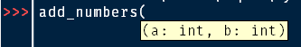

<!-- TOC start (generated with https://github.com/derlin/bitdowntoc) -->

- [Python Installation](#python-installation)
   * [Windows](#windows)
   * [Mac OSX](#mac-osx)
   * [Linux (Fedora)](#linux-fedora)
   * [Linux (Ubuntu 22.04)](#linux-ubuntu-2204)
- [Virtual Environment](#virtual-environment)
- [Project Setup](#project-setup)
- [Writing Code](#writing-code)
- [Building Python Code](#building-python-code)
- [A Simple Test Case](#a-simple-test-case)
- [Conclusion](#conclusion)

<!-- TOC end -->

The modern way of building python projects has changed a bit from the traditional way I've seen a lot of tutorials cover. This is even more so true with the release of Python 3.12 which changes some of the rules for how python projects operate. In this series I'd like to explore a more modern form of python project creation, starting at a very basic skeleton project to get acclimated to how things work. Then I'll start to introduce new features over the course of the series to improve your overall project.

## Python Installation

It's pretty difficult to develop a python project without, well, python! I'll introduce the most straightforward installation methods for various operating systems that beginners might have. I'll be targeting 3.11 for the python version to install. While 3.12 is technically the latest, it still needs some time for popular packages to support it so I don't recommend it currently for beginner use.

### Windows

Installing python for Windows is extremely simple. Just download the latest 3.11 installer you see on the [downloads page](https://www.python.org/downloads/windows/). You can just accept the defaults for everything. Once finished you may need to restart any terminal/powershell session you were working with to pickup the new version. If you're more comfortable with a slightly different installation method, you can also use [chocolatey](https://chocolatey.org/install). Once it's installed simply run:

```
> choco install python311
```

as an admin user. It uses the same Windows installers from the downloads page but makes the installation process a lot more automated. This can be useful for installing multiple versions later on in a hassle free manner.

### Mac OSX

For this I'm actually going to suggest a more unorthodox method and recommend using the [Mac OS installers](https://www.python.org/downloads/macos/). Version selection is the same as windows simply picking the most up to date 3.11 version. For those wondering why I didn't suggest homebrew, it's because that requires the XCode tools installation which I'd rather not have newcomers to the language deal with (especially if something goes wrong during compilation).

### Linux (Fedora)

I find that Fedora's installation method makes it one of the more user friendly ways of installing python (it also supports a wide variety of python versions out of the box, something that will be useful later). To install 3.11 simply run:

```
$ sudo dnf check-update
$ sudo dnf install python3.11

```

`dnf check-update` is used to update the list of available packages to make sure we're installing the latest supported version of 3.11.

### Linux (Ubuntu 22.04)

While slightly similar to Fedora in regards to installation, Ubuntu needs one more step to open up a wider range of python versions:

```
$ sudo add-apt-repository ppa:deadsnakes/ppa -y
$ sudo apt-get update
```

This will setup the deadsnakes package installation source. It's a popular method for installing python versions in Ubuntu. Note that python 3.11 is technically available as an installable package. If you see any output from ` sudo apt list --installed | grep 3.11` with python in it you can skip this step. If you don't go ahead and install it:

```
$ sudo apt-get install python3.11-full
```

## Virtual Environment

[Virtual Environments](https://docs.python.org/3/library/venv.html) are a feature that has been part of python itself since version 3.3. It allows you to isolate both a python version and any packages you install with it. Every python project I develop with uses a virtual environment for such isolation purposes. Now I generally like to create these virtual environments inside the target project's directory so I know exactly what it's tied to. If you use GitHub's [python gitignore file](https://github.com/github/gitignore/blob/main/Python.gitignore) naming the virtual environment folder as `venv` or `.venv` will [ensure it doesn't get committed](https://github.com/github/gitignore/blob/main/Python.gitignore#L122-L129) (which you don't want). So I'll make a new project folder and create a virtual environment inside of it:

```
$ mkdir my-python-test
$ cd my-python-test
$ python3.11 -m venv venv
```

Now there are two important things happening here in the final command:

- `python3.11`: We're explicitly calling the exact python version we want. Python can have multiple versions installed at the same time, which sometimes can make it difficult to handle which version `python` by itself is bound to. You should always use this explicit version form unless you're inside of a virtual environment.
- `-m venv` This is a special way to call certain python packages. Some packages have executable scripts attached to them, such as `venv`. However, if we call them without being in a virtual environment there's can be confusion on which version of python that executable script is associated with. To avoid this we use the special `python3.11 -m venv` form so we know  the venv executable script is being run specifically on python3.11 and avoids confusion. This is also a best practice for python development.

In its current state the virtual environment has been setup, but we need to activate in order for it to actually work. Activating a virtual environment can be done as follows:

**Linux/MacOS**
```
$ source venv/bin/activate
```

**Windows**
```
> .\venv\Scripts\activate.ps1
```

Your command prompt should now have a `(venv)` at the front of it to clearly indicate you're inside a virtual environment. If later on you want to switch to another virtual environment you can simply run:

```
$ deactivate
```

to do so. Then the next time you want to use that virtual environment again then simply run the respective activate script according to your operating system.

## Project Setup

Before continuing make sure you've got the previously created virtual environment activated again. Then in your editor of choice, create a file named `pyproject.toml` in the project directory. Now add content like this:

```toml
[build-system]
requires = ["setuptools>=61.0"]
build-backend = "setuptools.build_meta"

[project]
name = "my_python_test"
version = "0.0.1"
authors = [
  { name="Chris White", email="dont-spam-me@no.spam" },
]
description = "A small example package"
readme = "README.md"
requires-python = ">=3.9"
classifiers = [
    "Programming Language :: Python :: 3",
    "License :: OSI Approved :: MIT License",
    "Operating System :: OS Independent",
]
```

A few fields that can differ from project to project:

- `my_python_test` is used for the module name. Module names don't work well with hyphens so we use lowercase instead. Package names on the other hand (the folder that contains everything) can named with hyphens and cause no issues.
- `authors`: Here you'll put your own name instead, as well as an email address.
- `version`: This can be used to keep track of the version of your package. 

Now that our project is configured it's time to setup the project's directory structure. First we'll add some documentation files which are also useful if you plan to share the code in someplace such as [GitHub](https://github.com/). Create a new file called `README.md` using your favorite editor in the project directory with whatever content you want to introduce the project:

```markdown
## My Python Test Project

This is a sample python project for learning how python project layout works.
```

Another recommendation is to include a LICENSE file. This gives rules on what others can do with your code. Some users won't even install or use your code at all if there's no LICENSE. While technically not required for this sample project, it's a good habit to get into if you plan to share your python code with others later. The site [Choose an open source license](https://choosealicense.com/) is a resource I highly recommend. I tend to go with the [MIT license](https://choosealicense.com/licenses/mit/) for most of my projects:

```
MIT License

Copyright (c) 2023 Christopher White

Permission is hereby granted, free of charge, to any person obtaining a copy
of this software and associated documentation files (the "Software"), to deal
in the Software without restriction, including without limitation the rights
to use, copy, modify, merge, publish, distribute, sublicense, and/or sell
copies of the Software, and to permit persons to whom the Software is
furnished to do so, subject to the following conditions:

The above copyright notice and this permission notice shall be included in all
copies or substantial portions of the Software.

THE SOFTWARE IS PROVIDED "AS IS", WITHOUT WARRANTY OF ANY KIND, EXPRESS OR
IMPLIED, INCLUDING BUT NOT LIMITED TO THE WARRANTIES OF MERCHANTABILITY,
FITNESS FOR A PARTICULAR PURPOSE AND NONINFRINGEMENT. IN NO EVENT SHALL THE
AUTHORS OR COPYRIGHT HOLDERS BE LIABLE FOR ANY CLAIM, DAMAGES OR OTHER
LIABILITY, WHETHER IN AN ACTION OF CONTRACT, TORT OR OTHERWISE, ARISING FROM,
OUT OF OR IN CONNECTION WITH THE SOFTWARE OR THE USE OR OTHER DEALINGS IN THE
SOFTWARE.
```

The copyright notice should be updated to the current year and your full name. If you prefer another license that's fine as well. You just want to be sure the license exists! Now to make a directory for our code:

**Windows**
```
> New-Item -name src\my_python_test -Force -Type Directory
```

**Linux/MacOS**
```
$ mkdir -p src/my_python_test
```

Next we'll create a blank file named `__init__.py` in the new directory:

**Windows**
```
> New-Item -name src\my_python_test\__init__.py -Type File
```

**Linux/MacOS**
```
$ touch -p src/my_python_test/__init__.py
```

This is a special file to describe the code in the same directory as importable. There are other uses for it as well, but not too important if you're just starting out.

## Writing Code

Now it's time to write our python code. For python there's actually a very simple python GUI IDE called [IDLE](https://docs.python.org/3/library/idle.html) built in. It's fine to use your editor of choice if you want (especially if you're not in a GUI environment). I'll go ahead and open IDLE like so:

```
$ python -m idlelib src/my_python_test/mymath.py
```

I would recommend immediately heading over to `Options` -> `Configure IDLE` to customize the way it looks to your liking. Mine looks something like this after customization:


From here I'll add in some functions which do very simple mathematical operations for demonstration purposes:

```python
def add_numbers(a: int, b: int):
    return a + b

def subtract_numbers(a: int, b: int):
    return a - b

def multiply_numbers(a: int, b: int):
    return a * b

def divide_numbers(a: int, b: int):
    return a / b
```

Now if you save the file and then go to `Run` -> `Run Module` it will load the code into something called a REPL. This let's you run python code interactively. The REPL includes some interesting features such as tab completion of functions and parameter hints to let you know what the function is expecting for input:



From here I can try out all of the functions I defined in `mymath.py`:


Text Version:

```
add_numbers(3, 4)
7
subtract_numbers(5, 3)
2
multiply_numbers(3, 3)
9
divide_numbers(6, 3)
2.0
```

Now we're done writing code for now so go ahead and exit out of IDLE (or your editor of choice).

## Building Python Code

In order to easily build the code here I'm going to be using the PyPA [build module](https://pypa-build.readthedocs.io/en/stable/index.html). `pip` is python's package manager and used both directly and indirectly to install python packages. It's similar to `npm` for NodeJS and `gem` for Ruby. To install the build module simply run:

```
$ python -m pip install build
```

Now we can build the project by running:

```
$ python -m build
<snip>
Successfully built my-python-test-0.0.1.tar.gz and my_python_test-0.0.1-py3-none-any.whl
```

So we've ended up with two files. What exactly is their purpose? The first is called an sdist or source distribution. In this case there isn't much difference in content, but in some builds it may contain extra files necessary to build the python code on a target system. Depending on what your dependencies and target user OS looks like, this is the version that may get used. Wheels (`whl`) on the other hand are very simple installers where everything you need is included. There are some caveats with this which I might cover in a later installment. With these built I can use `pip` to install my package locally:

```
> python -m pip install ./dist/my_python_test-0.0.1-py3-none-any.whl
Processing c:\users\johndoe\my-python-test\dist\my_python_test-0.0.1-py3-none-any.whl
Installing collected packages: my-python-test
Successfully installed my-python-test-0.0.1
```

I can also test this out in the python REPL:

```
> python
Python 3.11.5 (tags/v3.11.5:cce6ba9, Aug 24 2023, 14:38:34) [MSC v.1936 64 bit (AMD64)] on win32
Type "help", "copyright", "credits" or "license" for more information.
>>> from my_python_test.mymath import add_numbers
>>> add_numbers(1,3)
4
>>> import sys
>>> sys.exit()
```

Don't worry too much about the `from` statement for now, just know that it's how we import our now installed code. In a later installment we'll look at how code can be organized more efficiently.

## A Simple Test Case

For this section I just want to show that testing python code is a feature. I won't dive too much into testing as a whole since it's a subject that deserves its own article, maybe its own series. It's recommended to put tests into their own directory:

**Windows**
```
> New-Item -Name tests -Type Directory
```

**Linux/MacOS**
```
$ mkdir tests
```

Since unit tests are written in python, we can use IDLE or editor of choice again:

```
$ python -m idlelib tests/test_mymath.py
```

Then the tests will look like this:

```python
import unittest
from my_python_test.mymath import add_numbers, subtract_numbers, multiply_numbers, divide_numbers

class TestMyMathMethods(unittest.TestCase):

    def test_add(self):
        self.assertEqual(add_numbers(2, 3), 5)

    def test_subtract(self):
        self.assertEqual(subtract_numbers(0, 3), -3)
        self.assertEqual(subtract_numbers(5, 3), 2)

    def test_multiply(self):
        self.assertEqual(multiply_numbers(3, 0), 0)
        self.assertEqual(multiply_numbers(2, 3), 6)

    def test_divide(self):
        self.assertEqual(divide_numbers(6,3), 2.0)
        with self.assertRaises(ZeroDivisionError):
            divide_numbers(3,0)

if __name__ == '__main__':
    unittest.main()
```

So here there are some interesting test cases where I'm looking for things like:

- Negative numbers when subtracting
- Multiplication by 0 produces 0
- Python throws an error if I attempt to divide by 0

If I go to the project's `src/` directory an run:

```
$ cd src/
$ python -m unittest discover ../tests
....
----------------------------------------------------------------------
Ran 4 tests in 0.000s

OK
```

It shows that all my tests look fine. Now if I change my `test_add` to this:

```python
    def test_add(self):
        self.assertEqual(add_numbers(2, 3), 6)
```

When running this test suite I get a failure:

```
> python -m unittest discover ../tests
F...
======================================================================
FAIL: test_add (test_mymath.TestMyMathMethods.test_add)
----------------------------------------------------------------------
Traceback (most recent call last):
  File "C:\Users\johndoe\my-python-test\tests\test_mymath.py", line 7, in test_add
    self.assertEqual(add_numbers(2, 3), 6)
AssertionError: 5 != 6
```

Since as the failure indicates 2+3 does not equal 6. With this we have our project fairly well setup.

## Conclusion

This concludes a beginner look at how to develop a python package using a modern package layout. This includes:

- Installing python
- Setting up a virtual environment
- Calling modules via the `python -m module` format
- Creating a `pyproject.toml` file, LICENSE, and README.md
- Developing module code with IDLE
- Building python code
- Testing python code

Now all this might start to become rather tedious as we add more projects. In the next installment I'll be looking at different solutions to automate python project creation and different types of code layouts.