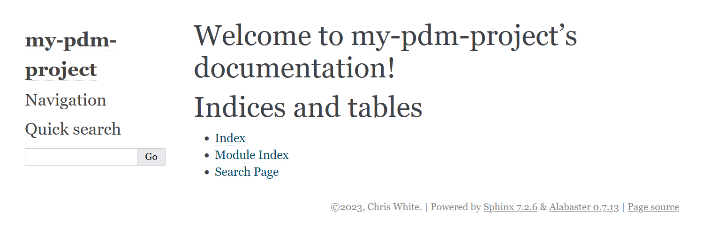
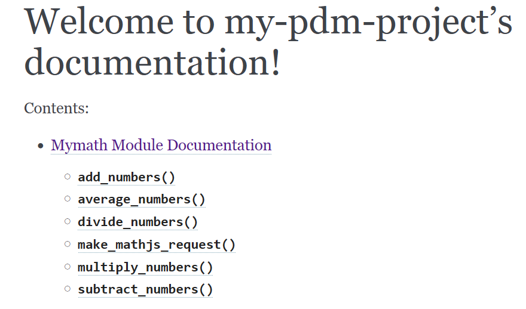
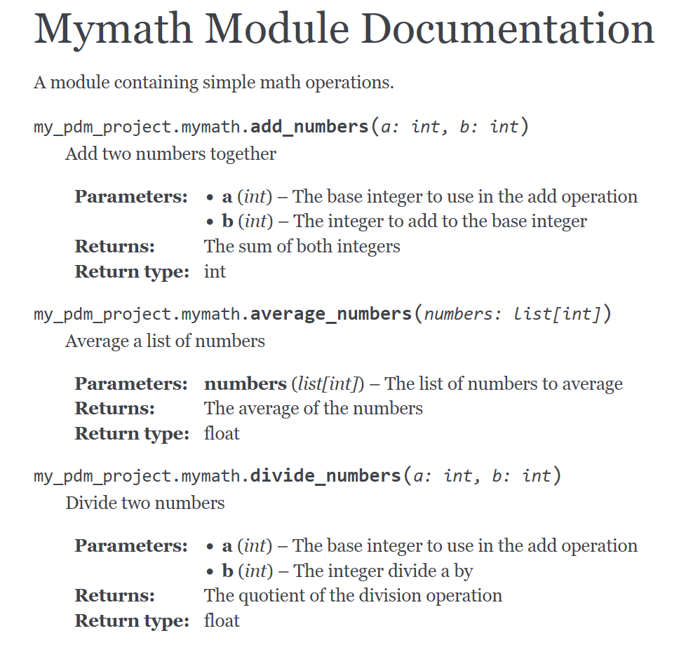



- [pylint Prep](#pylint-prep)
- [Docstrings](#docstrings)
- [Documentation Generation With sphinx](#documentation-generation-with-sphinx)
- [Conclusion](#conclusion)



In the last installment of the series we looked at how to achieve testing in our python projects. Much like testing, documentation can go a long way towards achieving adoption for your project. In this case we're going to be looking at how to generate documentation of your code using docstrings and [sphinx](https://sphinx-rtd-tutorial.readthedocs.io/).

## pylint Prep

When doing the linting I explicitly disabled checking for docstrings. Now that we'll be using them, it's time to enable that check in the `pyproject.toml` file. First however, we'll want to check what the current state of our code is:

```
> pdm run pylint --recursive=y .
************* Module src.my_pdm_project.mymath
src\my_pdm_project\mymath.py:10:4: R1720: Unnecessary "elif" after "raise", remove the leading "el" from "elif" (no-else-raise)
src\my_pdm_project\mymath.py:16:10: W3101: Missing timeout argument for method 'requests.get' can cause your program to hang indefinitely (missing-timeout)
src\my_pdm_project\mymath.py:20:4: R1705: Unnecessary "else" after "return", remove the "else" and de-indent the code inside it (no-else-return)
************* Module tests.test_mymath
tests\test_mymath.py:23:11: C0123: Use isinstance() rather than type() for a typecheck. (unidiomatic-typecheck)
tests\test_mymath.py:24:11: C0123: Use isinstance() rather than type() for a typecheck. (unidiomatic-typecheck)

------------------------------------------------------------------
Your code has been rated at 9.25/10 (previous run: 9.25/10, +0.00)
```

So we see how the general development process works of writing code, checking with linting, and fixing things that come up. So first off is this section:

```python
    if operation == '/' and b == 0:
        raise ZeroDivisionError
    elif operation not in SUPPORTED_OPERATIONS:
        raise ValueError
```

This is pretty simple, it just wants an `if` used instead of `elif` due to how exceptions handle breaks of logic flow. I'll go ahead and update it here:

```python
    if operation == '/' and b == 0:
        raise ZeroDivisionError
    if operation not in SUPPORTED_OPERATIONS:
        raise ValueError
```

The next is that requests is being used without setting a timeout value. If the server was not responsive then our connection might end up in a stuck state. I'll go ahead and fix that here:

```python
    res = requests.get(
        f'{BASE_URI}{operation_expression}', timeout=20
    )
```

This will throw an error if a response is not received within 20 seconds. Next is that the else here is redundant:

```python
    if operation == '/':
        return float(res.text)
    else:
        return int(res.text)
```

I'll go ahead and update that here:

```python
    if operation == '/':
        return float(res.text)
    return int(res.text)
```

Finally in our tests we're using `type()` instead of `isinstance()` which is cleaner. I'll go ahead and update the tests to do that:

```python
    assert result == 5
    assert isinstance(result, int)
    assert isinstance(result2, float)
```

Now that everything is cleaned up I'll go ahead and run `pylint` again:

```
> pdm run pylint --recursive=y .

-------------------------------------------------------------------
Your code has been rated at 10.00/10 (previous run: 9.25/10, +0.75)
```

Now it's time to enable the docstring check. I'll go ahead and do this by removing the following portion from `pyproject.toml`:

```ini
[tool.pylint."MESSAGES CONTROL"]
disable = '''
missing-module-docstring,
missing-class-docstring,
missing-function-docstring
'''
```

Now I'll run `pylint` again:

```
> pdm run pylint --recursive=y .
************* Module src.my_pdm_project.mymath
src\my_pdm_project\mymath.py:1:0: C0114: Missing module docstring (missing-module-docstring)
src\my_pdm_project\mymath.py:9:0: C0116: Missing function or method docstring (missing-function-docstring)
src\my_pdm_project\mymath.py:25:0: C0116: Missing function or method docstring (missing-function-docstring)
src\my_pdm_project\mymath.py:29:0: C0116: Missing function or method docstring (missing-function-docstring)
src\my_pdm_project\mymath.py:33:0: C0116: Missing function or method docstring (missing-function-docstring)
src\my_pdm_project\mymath.py:37:0: C0116: Missing function or method docstring (missing-function-docstring)
src\my_pdm_project\mymath.py:41:0: C0116: Missing function or method docstring (missing-function-docstring)
************* Module tests.test_mymath
tests\test_mymath.py:1:0: C0114: Missing module docstring (missing-module-docstring)
tests\test_mymath.py:16:0: C0116: Missing function or method docstring (missing-function-docstring)
tests\test_mymath.py:27:0: C0116: Missing function or method docstring (missing-function-docstring)
tests\test_mymath.py:32:0: C0116: Missing function or method docstring (missing-function-docstring)
tests\test_mymath.py:39:0: C0116: Missing function or method docstring (missing-function-docstring)
tests\test_mymath.py:46:0: C0116: Missing function or method docstring (missing-function-docstring)
tests\test_mymath.py:52:0: C0116: Missing function or method docstring (missing-function-docstring)
tests\test_mymath.py:62:0: C0116: Missing function or method docstring (missing-function-docstring)

-------------------------------------------------------------------
Your code has been rated at 7.61/10 (previous run: 10.00/10, -2.39)
```

So as you can see there's a lot of output. Now let's talk about how to go about fixing this.

## Docstrings

Docstrings are done by enclosing text in triple double quotes. As an example:

```python
def add_numbers(a: int, b: int):
    """
    This is my function
    """
    return make_mathjs_request(a, b, '+')
```

Now the official docstring specification is part of [PEP 257](https://peps.python.org/pep-0257/). While it does describe the overall format it's not specific about the format of what you would put in a doc string. In this case I'm going to be utilizing sphinx as the code documentation generator of choice. Now let's look at what our function's doc string will become using the sphinx format:

```python
def add_numbers(a: int, b: int):
    """Add two numbers together

    :param a: The base integer to use in the add operation
    :type a: int
    :param b: The integer to add to the base integer
    :type b: int

    :return: The sum of both integers
    :rtype: int
    """
```

`:param:` indicates what a parameter is meant for and `:type:` indicates the type of the parameter. `:return:` will describe the return of the function and `:rtype:` the return value. Now after implementing this docstring and running `pylint` again:

```
> pdm run pylint --recursive=y .
************* Module src.my_pdm_project.mymath
src\my_pdm_project\mymath.py:1:0: C0114: Missing module docstring (missing-module-docstring)
src\my_pdm_project\mymath.py:9:0: C0116: Missing function or method docstring (missing-function-docstring)
src\my_pdm_project\mymath.py:39:0: C0116: Missing function or method docstring (missing-function-docstring)
src\my_pdm_project\mymath.py:43:0: C0116: Missing function or method docstring (missing-function-docstring)
src\my_pdm_project\mymath.py:47:0: C0116: Missing function or method docstring (missing-function-docstring)
src\my_pdm_project\mymath.py:51:0: C0116: Missing function or method docstring (missing-function-docstring)
************* Module tests.test_mymath
tests\test_mymath.py:1:0: C0114: Missing module docstring (missing-module-docstring)
tests\test_mymath.py:16:0: C0116: Missing function or method docstring (missing-function-docstring)
tests\test_mymath.py:27:0: C0116: Missing function or method docstring (missing-function-docstring)
tests\test_mymath.py:32:0: C0116: Missing function or method docstring (missing-function-docstring)
tests\test_mymath.py:39:0: C0116: Missing function or method docstring (missing-function-docstring)
tests\test_mymath.py:46:0: C0116: Missing function or method docstring (missing-function-docstring)
tests\test_mymath.py:52:0: C0116: Missing function or method docstring (missing-function-docstring)
tests\test_mymath.py:62:0: C0116: Missing function or method docstring (missing-function-docstring)

------------------------------------------------------------------
Your code has been rated at 7.76/10 (previous run: 7.61/10, +0.15)
```

We can see there is a slight increase in our overall score since we added the docstring. Now one issue here is that pylint is expecting the tests to have docstrings. Functionality wise we really don't need them in our tests since the point of code documentation is to show the users how the code they're consuming works. A general user isn't going to be consuming tests. At the top of the test file I can tell `pylint` to ignore docstrings for them since I still want it to make sure the other parts of my tests are solid:

```python
# pylint: disable=missing-docstring
from urllib.parse import quote_plus
import pytest
import requests_mock

from my_pdm_project.mymath import (
    add_numbers,
```

Now after running `pylint`:

```
> pdm run pylint --recursive=y .
************* Module src.my_pdm_project.mymath
src\my_pdm_project\mymath.py:1:0: C0114: Missing module docstring (missing-module-docstring)
src\my_pdm_project\mymath.py:9:0: C0116: Missing function or method docstring (missing-function-docstring)
src\my_pdm_project\mymath.py:39:0: C0116: Missing function or method docstring (missing-function-docstring)
src\my_pdm_project\mymath.py:43:0: C0116: Missing function or method docstring (missing-function-docstring)
src\my_pdm_project\mymath.py:47:0: C0116: Missing function or method docstring (missing-function-docstring)
src\my_pdm_project\mymath.py:51:0: C0116: Missing function or method docstring (missing-function-docstring)

------------------------------------------------------------------
Your code has been rated at 9.05/10 (previous run: 8.96/10, +0.09)
```

So I'm a big closer here. Now besides the functions it's also mentioning a module docstring. At the top of our python code we can simply write a description of what the underlying code is meant to do:

```python
"""
A module containing simple math operations.
"""
from urllib.parse import quote_plus
import numpy as np
import requests
```

Now another check:

```
> pdm run pylint --recursive=y .
************* Module my_pdm_project.mymath
src\my_pdm_project\mymath.py:12:0: C0116: Missing function or method docstring (missing-function-docstring)
src\my_pdm_project\mymath.py:42:0: C0116: Missing function or method docstring (missing-function-docstring)
src\my_pdm_project\mymath.py:46:0: C0116: Missing function or method docstring (missing-function-docstring)
src\my_pdm_project\mymath.py:50:0: C0116: Missing function or method docstring (missing-function-docstring)
src\my_pdm_project\mymath.py:54:0: C0116: Missing function or method docstring (missing-function-docstring)

------------------------------------------------------------------
Your code has been rated at 9.21/10 (previous run: 9.05/10, +0.16)
```

So now just the function docstrings are left. Let's look at a more complex example for `make_mathjs_request`:

```python
def make_mathjs_request(a: int, b: int, operation: str):
    """Make a expression call against the MathJS API

    :param a: Base integer for the operation
    :type a: int
    :param b: Integer to use with a in the operation
    :type b: int
    :param operation: Operation to run against a and b
    :type operation: str

    :raises ZeroDivisionError: Raised if division by 0
    :raises ValueError: Raised if not a supported operation

    :returns:
        - int for non division operations
        - float for division operations
    """

```

Here it's somewhat like what we saw before. What's new now is that we also documentation exceptions that can be raised, and why they'd be raised. The `:returns:` is used since we're returning either a float or int depending on the operation. As mentioned before this was done as an example case for showing testing and normally you wouldn't want a function to return multiple types. After a `pylint` run:

```
> pdm run pylint --recursive=y .
************* Module my_pdm_project.mymath
src\my_pdm_project\mymath.py:58:0: C0116: Missing function or method docstring (missing-function-docstring)
src\my_pdm_project\mymath.py:62:0: C0116: Missing function or method docstring (missing-function-docstring)
src\my_pdm_project\mymath.py:66:0: C0116: Missing function or method docstring (missing-function-docstring)
src\my_pdm_project\mymath.py:70:0: C0116: Missing function or method docstring (missing-function-docstring)

------------------------------------------------------------------
Your code has been rated at 9.37/10 (previous run: 9.21/10, +0.16)
```

So I just need to add docstrings to the other functions. After all is done the file looks like this:

```python
"""
A module containing simple math operations.
"""
from urllib.parse import quote_plus
import numpy as np
import requests

BASE_URI = "http://api.mathjs.org/v4/?expr="
SUPPORTED_OPERATIONS = ['+', '-', '*', '/']


def make_mathjs_request(a: int, b: int, operation: str):
    """Make a expression call against the MathJS API

    :param a: Base integer for the operation
    :type a: int
    :param b: Integer to use with a in the operation
    :type b: int
    :param operation: Operation to run against a and b
    :type operation: str

    :raises ZeroDivisionError: Raised if division by 0
    :raises ValueError: Raised if not a supported operation

    :returns:
        - int for non division operations
        - float for division operations
    """
    if operation == '/' and b == 0:
        raise ZeroDivisionError
    if operation not in SUPPORTED_OPERATIONS:
        raise ValueError

    operation_expression = quote_plus(f'{a}{operation}{b}')
    res = requests.get(
        f'{BASE_URI}{operation_expression}', timeout=20
    )

    if operation == '/':
        return float(res.text)
    return int(res.text)


def add_numbers(a: int, b: int):
    """Add two numbers together

    :param a: The base integer to use in the add operation
    :type a: int
    :param b: The integer to add to the base integer
    :type b: int

    :return: The sum of both integers
    :rtype: int
    """
    return make_mathjs_request(a, b, '+')


def subtract_numbers(a: int, b: int):
    """Subtract two numbers

    :param a: The base integer to use in the subtract operation
    :type a: int
    :param b: The integer to subtract the base integer from
    :type b: int

    :return: The subtraction of both numbers
    :rtype: int
    """
    return make_mathjs_request(a, b, '-')


def multiply_numbers(a: int, b: int):
    """Multiple two numbers together

    :param a: The base integer to use in the multiply operation
    :type a: int
    :param b: The integer to multiply against the base number
    :type b: int

    :return: The result of multiplying both numbers
    :rtype: int
    """
    return make_mathjs_request(a, b, '*')


def divide_numbers(a: int, b: int):
    """Divide two numbers

    :param a: The base integer to use in the add operation
    :type a: int
    :param b: The integer divide a by
    :type b: int

    :return: The quotient of the division operation
    :rtype: float
    """
    return make_mathjs_request(a, b, '/')


def average_numbers(numbers: list[int]):
    """Average a list of numbers

    :param numbers: The list of numbers to average
    :type numbers: list[int]

    :return: The average of the numbers
    :rtype: float
    """
    return np.average(numbers)

```

After finishing up documenting everything here we can check what `pylint` has to say:

```
> pdm run pylint --recursive=y .

-------------------------------------------------------------------
Your code has been rated at 10.00/10 (previous run: 9.37/10, +0.63)
```

Everything is in the clear now! 

## Documentation Generation With sphinx

Now as is the code documentation is a bit difficult to work with for an average user. To help with this we can use [sphinx](https://sphinx-rtd-tutorial.readthedocs.io/) to take our docstrings and generate them into various formats. As with our other tools this will be added as a development package:

```
> pdm add -dG dev sphinx
```

Now we'll need to create a document directory for where our documentation will be stored.

```
> mkdir docs
```

Now it's time to setup sphinx to generate documentation. The thing to keep in mind with sphinx is it's primarily a documentation generation tool and generation of library documentation is a side bonus. With this in mind we'll go ahead and setup how our project will work vi the nice `sphinx-quickstart` utility:

```
> cd docs
> pdm run sphinx-quickstart --no-makefile -M --ext-autodoc -p "my-pdm-project" -a "Chris White" -v "0.3.0" -r "0.3.0" -l "en" --sep .
```

So there's a few things to digest here. `--no-makefile` and `-M` are done to avoid using make for building. This was mostly to avoid adding in another thing to install. `-p` sets the name of the project, `-a` the author, `-v` and `-r` are for version and release. They're the same right now because there's no 1.0 release yet, but if there was I'd recommend something like `1.0` for the version and `1.0.0` for the release. It's somewhat like how there's `3.12` for python but the `3.12` version has several releases under it. `-l` sets the language of the project and `--sep` ensures that source and build directories are separate. I tend to prefer this because it's easier to ignore the build directory through things like `.gitignore` later on. Finally `.` indicates the directory of the project, or more specifically the "documentation project" (as supposed to the code project where all our code is). Now that everything is setup we can use `sphinx-build` to generate html for us:

```
> pdm run sphinx-build source/ build/
```

Now if I look in the build directory there will be an `index.html` I can access via a browser:



Right now there isn't much going on and "Module Index" doesn't work because it hasn't been setup to recognize our docstrings. To do this we'll create a new file in `docs/source/` called `mymath.rst` with the following content:

```rst
Mymath Module Documentation
===========================
.. automodule:: my_pdm_project.mymath
    :members:
```

Now this format is known as rst or [reStructuredText](https://www.sphinx-doc.org/en/master/usage/restructuredtext/). It's a format that's more feature rich than markdown and useful for structured documentation. In this case it's referring to a function in rst. These functions are in the form:

```rst
.. function_name:: arguments
    :option: value

    content
```

In the case of automodule it will generate documentation for `my_pdm_project.mymath` including all of its members. Now in the same directory there will be an `index.rst` file that needs to be edited like so:

```rst
.. my-pdm-project documentation master file, created by
   sphinx-quickstart on Fri Nov 10 09:01:15 2023.
   You can adapt this file completely to your liking, but it should at least
   contain the root `toctree` directive.

Welcome to my-pdm-project's documentation!
==========================================
.. toctree::
   :maxdepth: 2
   :caption: Contents:

   mymath


Indices and tables
==================

* :ref:`genindex`
* :ref:`modindex`
* :ref:`search`
```

What's changed is that `mymath` has now been added to our table of contents. Note that contents are indicated by a blank line after the options. In this case the content is `mymath` on a single line. `sphinx` knows that this is referencing `mymath.rst` and `toctree` will automatically parse `mymath.rst` to provide a table of contents. Now after running this again in the `docs` directory:

```
> pdm run sphinx-build source/ build/
```

The main `index.html` page will show:



And clicking on "Mymath Module Documentation" will show the documentation generated via our doc strings:



## Conclusion

This concludes a look at documentation generation via sphinx parsing python docstrings. I will say that rst is more involved than simple markdown, but it's feature rich nature makes it ideal for many forms of documentation structure. In the next section we'll be looking at orchestrating all of our tools so far and uploading our code for everyone to use.