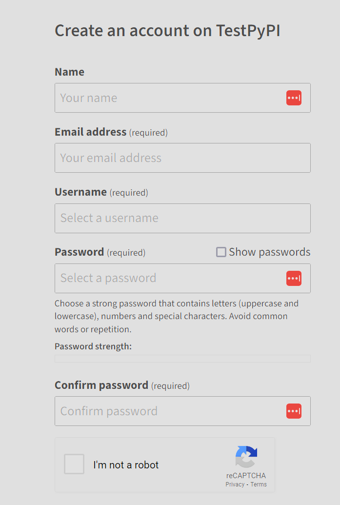
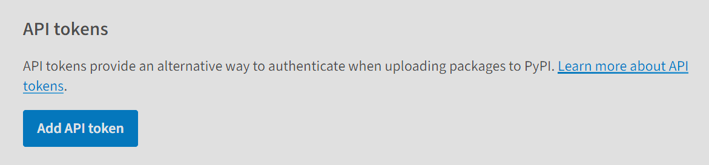
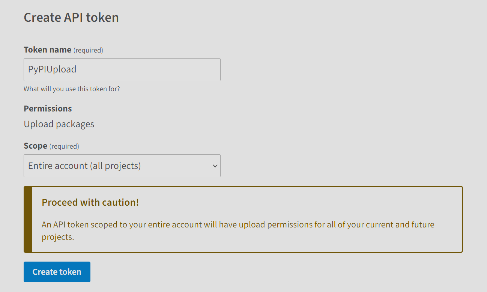
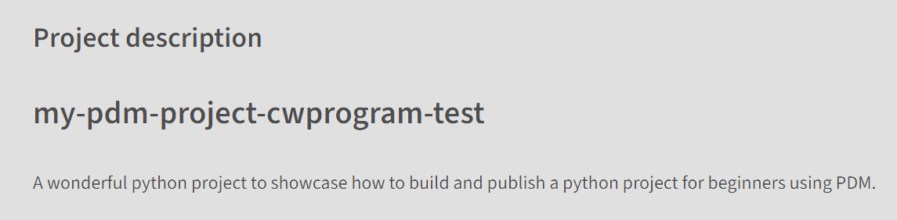
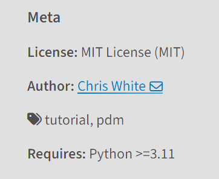
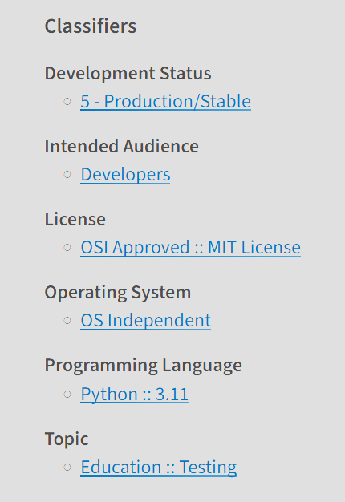



- [PyPI Background](#pypi-background)
- [PyPI Account Creation](#pypi-account-creation)
- [Package Refactor](#package-refactor)
- [Twine Upload](#twine-upload)
- [Adding Metadata](#adding-metadata)
   * [Classifiers](#classifiers)
- [Conclusion](#conclusion)



In the last installment we looked at using tox to centralize our development tool workflow. We now have tests, n centralized way to check our code for issues, and documentation generation all in a single command. Now that our project is solid enough we need to look into releasing it to the general public. In this article we'll look at twine and using it to upload to the official PyPI servers.

## PyPI Background

The first step to uploading code is having someplace to upload it to. Python's official package repository is [PyPI](https://pypi.org/). This is similar to NPM if you're familiar with NodeJS. It's a centralized location for both uploading and downloading python packages. Packages here are meant to handle everything from common to complex tasks so you don't have to write it yourself. It does mean, however, that you have to be careful about what you install. Malicious packages has been a known issue to not just PyPI, but many other popular package repositories as well. Packages without tests to show confidence that it works or documentation to show how you use it may cost you more time than you save. Finally, you don't want to be relying on code you expect to evolve over time if it's not longer being maintained. 

## PyPI Account Creation

Before we upload anything we'll need a PyPI account. In this case I actually recommend doing so on their [test instance](https://test.pypi.org/). This allows you to test your package uploads and installation without causing impact to the main PyPI servers. The sign in form is simple with the usual name, address, username, password, and captcha verification:



After completing the signup take note of the username as it will be required later. There's also an email verification step you'll need to complete to ensure you actually own the email address. After this you'll want to setup two factor authentication or 2FA for short. This means you login with two "factors": something you remember and something you own. The [PyPI help page](https://pypi.org/help/#twofa) has information on setting this up for one of two methods:

- Software based, such as Google Authenticator
- Hardware based, such as a YubiKey

While YubiKeys are a bit on the pricey side the ability to authenticate by simply plugging in a device (and maybe taping a part of it) is very easy to do. Software solutions that work off of a smart phone can become an issue if your smart phone is misplaced or stolen. Once this is setup you'll want to go to your [manage account page](https://test.pypi.org/manage/account/) and there is an API token option towards the bottom:



Now tokens are the preferred way to authenticate against the system as if they are compromised you can simply generate a new one. If you use your account username and password instead and it's compromised getting your account back can be tedious. Clicking on Add API Token will lead to a screen that you can fill out like this:



On the test instance with your new account "Scope" only has one option so the warning can be ignored. Be sure to copy down the value as it will disappear afterwards and you'll have to regenerate it later if you forget. Now that our authentication details are available it's time to setup the upload process.

## Package Refactor

Now up until now we've been using the name `my_pdm_project` to represent our package. Unfortunately the issue with this method is that PyPI allows one unique package name globally. This means if someone were to upload `my_pdm_project` you wouldn't be able to upload your package code as-is to PyPI. To work around this we're going to rename the project to `my_pdm_project_[pypiusername]` where `[pypiusername]` is replaced with the username you chose during the PyPI registration process. In this example I'll use `my_pdm_project_cwprogram_test` (be sure to not actually use this but the version with your username instead). Please note that this is only this one specific case for general tutorial usage and you normally wouldn't put your username in the package name like that. So let's go ahead and make the changes. The first thing you'll need to do is go to the `src` directory and rename your `my_pdm_project` to the new one:

```
$ cd src
$ mv my_pdm_project my_pdm_project_cwprogram_test
```

`pyproject.toml` needs to be updated to reflect the new package name. Also since we're here we're going to update the version to `1.0.0` as this is considered our finalized public release:

```ini
[project]
name = "my-pdm-project-cwprogram-test"
version = "1.0.0"
```

Test suites need to be updated to point to the new package location in `tests/test_mymath.py`:

```python
from my_pdm_project_cwprogram_test.mymath import (
    add_numbers,
    average_numbers,
```

`tox.ini` needs an update so that code coverage is using the proper module name:

```ini
[testenv:test]
groups = testing
commands =
  pytest --cov=my_pdm_project_cwprogram_test
```

Sphinx will need updates in package name and version via `docs/source/config.py`:

```python
project = 'my-pdm-project-cwprogram-test'
copyright = '2023, Chris White'
author = 'Chris White'

version = '1.0.0'
release = '1.0'
```

Finally we'll update the module name for our automatic api documentation in `docs/source/mymath.rst`:

```rst
Mymath Module Documentation
===========================
.. automodule:: my_pdm_project_cwprogram_test.mymath
    :members:
```

To make sure we didn't miss anything:

```
> pdm run tox
<snip>
  lint: OK (4.59=setup[0.84]+cmd[0.56,3.19] seconds)
  test: OK (3.59=setup[3.05]+cmd[0.55] seconds)
  docs: OK (3.55=setup[2.86]+cmd[0.69] seconds)
  congratulations :) (11.81 seconds)
```

Now that everything looks good it's time to begin the upload process (I also hope this is a good lesson on why you should stick with a project name once you've decided on it).

## Twine Upload

Up until now I've recommended adding tools to our dev group in the PDM project. However `twine` is something where you want the authentication centralized and usable by all python environments. This fits the description of something that should be installed with `pipx` instead:

`> pipx install twine`

Now we need to configure authentication for twine to upload packages. For simplicity's sake I will be showing how to do this via a simple text file. Once you have gained more experience as a developer I highly recommend switching to [keyring](https://pypi.org/project/keyring/) as a more secure method (the sooner the better) so your password isn't in a plain text file (I avoided doing it here as keyring can be overwhelming for new developers). To get started you'll need to create a `.pypirc` file in your home directory. For Linux and OSX you should be able to shortcut it as `~/.pypirc` for Windows it will be in `%HOME%\.pypirc` in command prompt and `$env:HOME\.pypirc` in Powershell. Here is how the contents should look:

```ini
[distutils]
index-servers =
    testpypi

[testpypi]
repository = https://test.pypi.org/legacy/
username = __token__
password = pypi-[rest_of_token]
```

`__token__` as the username is a special indicator that we're using an API token instead of a regular username and password. `password` is the API token value you obtained when generating it, which starts with `pypi-`. Now that our authentication is in place it's time to test uploading to PyPI. Note that unlike the other tools `twine` should only be run when you actually intend to do a release. This means I don't recommend putting it in `tox.ini` and instead running it manually. When you become more experienced this process will end up as part of a Continuous Integration / Continuous Deployment (CI/CD) automation pipeline. So now it's time to upload our package:

```
> pdm build
> twine upload -r testpypi dist/*
```

First we're building a package to upload which goes into the `dist/` directory. Then we tell `twine` to upload the files in that directory. The `-r testpypi` tells `twine` to use the `testpypi` section we added to `.pypirc` earlier so it knows where to upload to. This is important as there are actually several potential candidates for uploading python packages to (private repositories such as AWS CodeArtifact and JFrog Artifactory for example). After the upload is complete you will see something like:

```
View at:
https://test.pypi.org/project/my-pdm-project-cwprogram-test/1.0.0/
```

Going to this page will show you the project page and how to install the package. I'll make a virtual environment real quick to show the installation:

```
> python3.11 -m venv pip_test_install_pypi
> pip_test_install_pypi/Scripts/activate
> pip install -i https://test.pypi.org/simple/ --extra-index-url https://pypi.org/simple/ my-pdm-project-cwprogram-test 
Looking in indexes: https://test.pypi.org/simple/, https://pypi.org/simple/
Collecting my-pdm-project-cwprogram-test
  Obtaining dependency information for my-pdm-project-cwprogram-test from https://test-files.pythonhosted.org/packages/de/82/cce488c69f576b1ba270d5efc91381010f4a0bbbdf17fb6837c81adeb47b/my_pdm_project_cwprogram_test-1.0.0-py3-none-any.whl.metadata
  Using cached https://test-files.pythonhosted.org/packages/de/82/cce488c69f576b1ba270d5efc91381010f4a0bbbdf17fb6837c81adeb47b/my_pdm_project_cwprogram_test-1.0.0-py3-none-any.whl.metadata (274 bytes)
Collecting numpy>=1.25.2 (from my-pdm-project-cwprogram-test)
  Obtaining dependency information for numpy>=1.25.2 from https://files.pythonhosted.org/packages/da/3c/3ff05c2855eee52588f489a4e607e4a61699a0742aa03ccf641c77f9eb0a/numpy-1.26.2-cp311-cp311-win_amd64.whl.metadata
<snip>
Successfully installed certifi-2023.11.17 charset-normalizer-3.3.2 idna-3.6 my-pdm-project-cwprogram-test-1.0.0 numpy-1.26.2 requests-2.31.0 urllib3-2.1.0
```

So this installation method differs from the one shown on the project page in that it adds the actual PyPI repository as another package source since we're overriding it. Without this the package wouldn't install as it wouldn't be able to find the proper version of `numpy`.

## Adding Metadata

As it is right now the package page is pretty bland because we haven't given enough information to describe our package. So it's time to open up `pyproject.toml` to add in a few things:

```ini
[project]
name = "my-pdm-project-cwprogram-test"
version = "1.0.1"
description = "A tutorial package for building python projects with PDM"
keywords = ["tutorial", "pdm"]
authors = [
    {name = "Chris White", email = "me@nospam.com.com"},
]
dependencies = [
    "numpy>=1.25.2",
    "requests>=2.31.0",
]
requires-python = ">=3.11"
readme = "README.md"
license = {text = "MIT"}

[project.urls]
Homepage = "https://dev.to/cwprogram"
```

Also the `version` needs to be updated to `1.0.1` in `docs/source/conf.py`. So we've updated the version and description as basic information. There's also a new keywords field which is useful for when a user is searching for packages. `[project.urls]` section was added to give a URL for the project (in this case it's just my dev.to page as there's no real project page). Now there's one more piece of useful information that can be added: classifiers.

### Classifiers

PyPI and other packaging formats have the concept of classifiers. There's an exhausting yet comprehensive list [on the pypi site](https://pypi.org/classifiers/). You can use it to tell users about what python your using, environmental constraints, integration with popular packages, operating systems, etc. Let's take a look at some of them we'll use:

- `Development Status :: 5 - Production/Stable`: This is considered a stable release with unit tests, linting, etc.
- `Operating System :: OS Independent`: The package doesn't use graphical interfaces or anything special and as such can run on major operating systems
- `Intended Audience :: Developers`: The intended audience is developers who are looking to create their own python packages
- `License :: OSI Approved :: MIT License`: Technically the `license` field already covers this but we'll let people know it's an MIT license as well
- `Programming Language :: Python :: 3.11`: This project supports Python 3.11
- `Topic :: Education :: Testing`: This is for educational purposes as a test project

The categories are good enough for our purposes. Once you get an actual project going I encourage you to look into these classifiers along with the keywords to make your project more easily discoverable by end users. Now for our finished product:

```ini
[project]
name = "my-pdm-project-cwprogram-test"
version = "1.0.1"
description = "A tutorial package for building python projects with PDM"
keywords = ["tutorial", "pdm"]
authors = [
    {name = "Chris White", email = "me@nospam.com"},
]
dependencies = [
    "numpy>=1.25.2",
    "requests>=2.31.0",
]
requires-python = ">=3.11"
readme = "README.md"
license = {text = "MIT"}
classifiers = [
  "Development Status :: 5 - Production/Stable",
  "Operating System :: OS Independent",
  "Intended Audience :: Developers",
  "License :: OSI Approved :: MIT License",
  "Programming Language :: Python :: 3.11",
  "Topic :: Education :: Testing"
]

[project.urls]
Homepage = "https://dev.to/cwprogram"
```

Finally re-uploading our new code:

```
> pdm build
> twine upload -r testpypi dist/*
```

Now if we look at the newer page you'll notice some differences:








So we have a reasonable description shown, our keywords are present, there's a homepage to point users to, and classifiers are available to give the user more metadata about our project. There are a few other fields and some ways to write fields differently, so I recommend looking over the official documentation on [writing pyproject.toml](https://packaging.python.org/en/latest/guides/writing-pyproject-toml/) for more information.

## Conclusion

This ends the beginners python series, and it's been a fun ride. It took about two months of work and I hope it helps beginners out there get a start on setting up python projects in a fairly modern way. Once your more comfortable I recommend looking into:

- [GitHub](https://github.com) to share your code
- [pre-commit](https://pre-commit.com/) to automate your tox runs with your git workflow
- [GitHub Actions](https://github.com/features/actions) for implementing CI/CD to automate your releases
- [readthedocs](https://about.readthedocs.com/) for hosting your sphinx documentation

Mastering these I would consider a step into being in an early intermediate level as a software developer. I hope you enjoyed this series and please look forward to more articles in the future! If you like what you see please check my dev.to profile as I'm open for work opportunities.