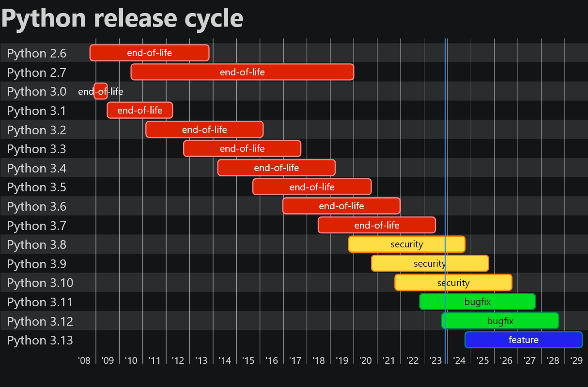



- [Python 2 and 3](#python-2-and-3)
- [Python Version Components](#python-version-components)
- [Python Release Cycle](#python-release-cycle)
   * [End Of Life](#end-of-life)
   * [Security](#security)
   * [Bugfix](#bugfix)
   * [Feature](#feature)
- [Which Version To Use](#which-version-to-use)
   * [Beginners](#beginners)
   * [Companies](#companies)
   * [Package Maintainers](#package-maintainers)
- [Supporting Multiple Versions](#supporting-multiple-versions)
- [Migrating Versions](#migrating-versions)
- [Conclusion](#conclusion)



As with all programming languages, the python has [multiple versions](https://www.python.org/doc/versions/) and a release cycle to go with it. Understanding this release cycle is crucial as a python developer to reducing tech debt in your stack. This article will look at multiple python versions, release cycles, and making decisions on which version to utilize.

## Python 2 and 3

If you've been in python long enough, you might have heard about the fun that is the python 2 to 3 transition. It was a fairly major revamp of the language which required migrations for a substantial portion of the userbase (myself included). It was so much that they [ended up making a tool for it](https://docs.python.org/3/library/2to3.html). This unfortunately left a sour taste for many developers as these kind of migrations can put pressure on developers employed in companies who are already attempting to meet deadlines. Needless to say it that many developers were [not thrilled about it](https://lwn.net/Articles/843660/). After many extensions of timelines, python 2 [received its end of life on January 1st 2020](https://www.python.org/doc/sunset-python-2/) with the python 2.7 series. The reason why I'm mentioning all of this is that it's definitely something python developers consider a not so great outcome and has had an impact on how they consider new version / large feature transitions.

## Python Version Components

Python versions include a major, minor, and micro component. It's slightly similar in concept to [semver](https://semver.org/), though the minor version may do something incompatible at times. An example of this is the [removal of distutils](https://peps.python.org/pep-0632/) in 3.12. While technically not a language change persay, it did mean some build systems had to be revamped to accommodate this change. In general you'll see python referred to in a `major.minor` format such as:

- Python 2.7
- Python 3.9
- Python 3.12

New releases and security fixes are where you'll tend to find them referred to in full version format such as:

- Python 2.7.17
- Python 3.9.18
- Python 3.12.0

Security releases use the full format so you know exactly which version(s) are affected. New releases show it so you can tell how many upgrade paths it would take to reach it. Since the release of python 3 in December of 2008 there hasn't been a new major release. This is due to requiring a substantial amount of incompatible changes. There hasn't been an plans announced for a python 4 at this time according to an [interview with the language's creator](https://www.youtube.com/watch?v=aYbNh3NS7jA). Though if there was it might be around reworking how the C API is handled which is a pain point for many.

## Python Release Cycle

The python dev guide has a [good breakdown](https://devguide.python.org/versions/) of the release cycle process. Here is a screenshot of the current release cycle:

As shown here there are quite a number of end-of-life versions, followed by security, then bugfixes, and finally a feature version. All categories are referenced by their respective `major.minor` version. Let's take a look at the categories and what they entail.

### End Of Life

Not much to say here, it basically means the version is not supported by python developers. No security, bugfixes, or feature additions will be added. Both source and binary version updates will no longer be available. You really want to avoid being on an end of life version, especially in corporate environment with security compliance programs.

### Security

Security releases are where developers will only add security updates, so there will be no feature updates or non-security related bugfixes. They also won't have binaries available on the official website. You generally want to avoid being on the oldest security release as that means an end-of-life will be in the future.

### Bugfix

These versions include fixes for bugs and security related issues. They also have official binaries available for them on the python website. If you're a new developer going for one of the bugfix versions would be ideal since binaries being available make them easier to install. The latest bugfix version would be ideal unless there's a chance that would require updates to popular packages. Bugfixes at some point will become security releases and lose their binary availability after the last bugfix release.

### Feature

This is more of a bleeding edge release. It indicates new features planned for the future. As 3.12 was recently released as bugfix, 3.13 is now the feature release. One planned introduction in particular is an [optional build mode that removes the global interpreter lock](https://discuss.python.org/t/a-steering-council-notice-about-pep-703-making-the-global-interpreter-lock-optional-in-cpython/30474). It's generally recommended for beginners to avoid these since it's more of an in progress release where certain tutorials may be outdated.

## Which Version To Use

So now the question becomes, which version should be utilized? Much of the answer lies in how it's utilized. One thing I will say is that no one should be using an end-of-life version (okay, maybe that one script from 2010 you wrote to parse movie titles). Let's take a look at some of the user categories and what version they might use.

### Beginners

In general I recommend beginners be on the latest bugfix version. The exception to this is I wouldn't pick up a recent bugfix release if it hasn't been out for at least 4 months (3.12 at time of writing would fall under this). This is because tutorials might need updating, and some popular python packages might need time to migrate to it. It's better to play it safe. The main reason for recommending it is that binaries are widely available which make installing them very easy to pull off. This goes for both Windows and Mac in particular.

### Companies

Recent startups may be closer to the bugfix versions as they don't have systems to migrate and being on newer versions is more advantageous tech debt wise. Enterprises generally stay within the security releases. Their focus is ensuring all their systems work as intended without unreasonable changes introduced. Sometimes there may be other limiting factors such as versions available through external solutions providers. AWS for example has a range of python versions for using with [AWS lambda](https://docs.aws.amazon.com/lambda/latest/dg/lambda-runtimes.html). They would want to be on at least 3.8 minimum given that there's a deprecation warning that went out recently for 3.7. There also might be requirements on what third party pip packages are available.

### Package Maintainers

In general package maintainers will decide which versions to support based on what their userbase looks like and how many people are motivated/available to maintain said versions. At minimum package maintainers will generally use the oldest security release all the way up to the latest bugfix release (save python 3.12 which required some updates). Packages may require other packages which have their own version constraints and can also restrict which version is supported.

## Supporting Multiple Versions

Package maintainers and other individuals may want to support multiple versions of python. For systems such as Windows and MacOSX you can download binaries of the bugfix versions. Security versions on the other hand don't have binaries officially available. In this particular case Linux is nice for working with multiple versions as packages are either installed from source or end binaries are build from source (especially important for security release where only the source is available). Distribution wise there are a few options:

- Ubuntu has some bugfixes available along with a [deadsnakes PPA](https://launchpad.net/~deadsnakes/+archive/ubuntu/ppa). Being non-official the security implications should be considered, but it allows for easily installation of various python versions in a distro friendly way.
- Fedora contains a wide range of python packages available through their built-in package manager. You could setup a quick dev box with [Fedora on Raspberry Pi](https://docs.fedoraproject.org/en-US/quick-docs/raspberry-pi/) as one solution.

For OSX there is [homebrew](https://brew.sh/) or [pyenv](https://github.com/pyenv/pyenv) (pyenv is another solution on Linux). As pyenv compiles from source it will require setting up XCode (the Apple IDE) tools to support this which can be pretty bulky. Windows users have [chocolatey](https://chocolatey.org/) but the issue there is it works off the binaries. That means it won't have the latest security release available since those are source only. [Conda](https://docs.conda.io/projects/conda/en/latest/user-guide/install/windows.html) is also another solution which can be picked up by Visual Studio Code as available versions of Python making development easier. In the end it might be best to consider using [WSL](https://learn.microsoft.com/en-us/windows/wsl/install) on Windows for installing a Linux version and using that instead.

## Migrating Versions

For companies I recommend looking into having upgrade path at regular intervals. The more you upgrade the less of a chance you'll be stuck with an EOL version. It also makes future upgrades easier, or at least gives you a buffer to handle issues. Having a CI/CD pipeline via something such as GitHun Actions along with a test suite makes this process even easier. Simply upgrade your pipeline to the new version then see what the test suite results are. If everything looks good you may be able to upgrade fairly easily. In the case of there being issues, you can at least have the gradual low priority tasks to investigate the issues and handle them at a better time. This is especially important in businesses with high priority deadlines.

## Conclusion

This concludes a look into how to work with Python versions. It's something I was planning to go over in my beginners series until I realized it would be better flushed out on its own article. I will note that future articles will have a different direction to them as I'm currently in job hunt mode. This means that the direction will be more towards selling myself as a technically competent individual instead of the usual "I want to mess around with this interesting tech". This includes potentially doing AWS articles that I've tried to avoid here due to not being open source (the stack at least). If you're interested in hiring me for a remote full time position please look at my [dev.to profile](https://dev.to/cwprogram) for more information.